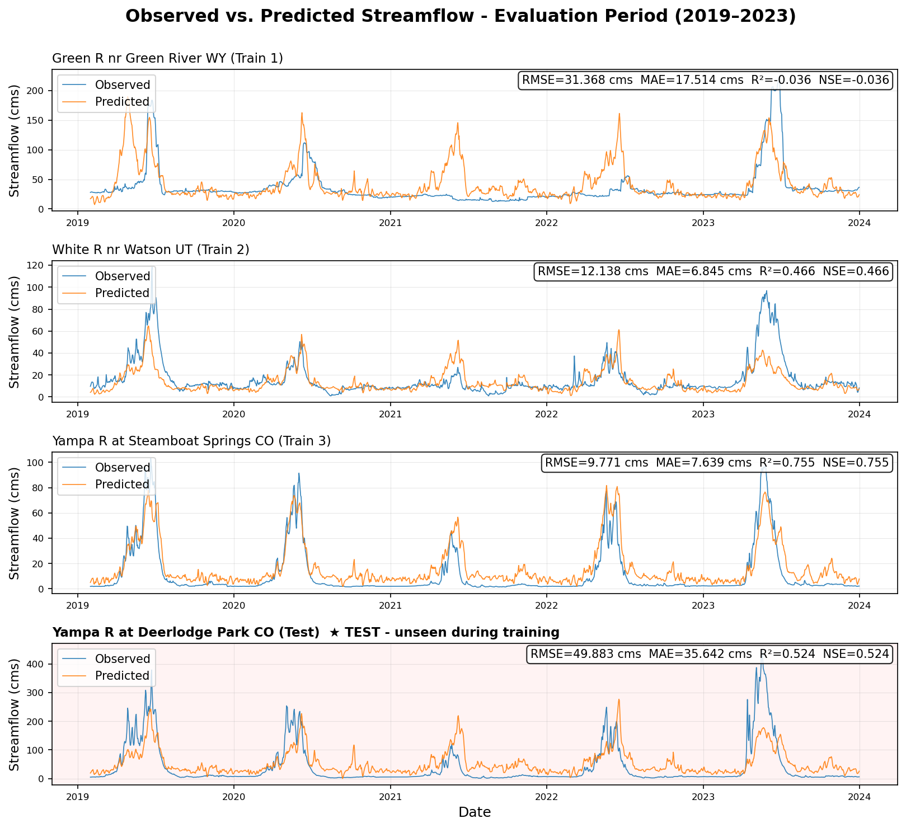

# Green Basin LSTM - Unregulated Streamflow Prediction

**Repository:** https://github.com/magnustveit1/green-basin-lstm

A PyTorch LSTM pipeline for predicting daily streamflow on unregulated tributaries of the Green River and Yampa/White River system. Developed as Assignment 3 for CVEEN 6920 (Hydroinformatics) at the University of Utah.

The model trains on three sites with distinct but unregulated hydrologic regimes, then predicts cold on a fourth unseen location downstream on the Yampa River. All gauges are confirmed free-flowing with no major dams upstream.

---

## Study Sites

| Role | Gauge ID | River | Location | Notes |
|---|---|---|---|---|
| Train 1 | 09217000 | Green River | nr Green River, WY | Snowmelt headwater; no dams upstream |
| Train 2 | 09306500 | White River | nr Watson, UT | Plateau snowmelt; no significant dams |
| Train 3 | 09239500 | Yampa River | at Steamboat Springs, CO | One of last free-flowing rivers in western U.S. |
| **Test** | **09251000** | **Yampa River** | **at Deerlodge Park, CO** | **Downstream of Train 3; adds Little Snake R. confluence; never seen during training** |

---

## Repository Structure

```
green-basin-lstm/
├── data_acquisition.py      # Fetches USGS streamflow + Daymet climate data
├── lstm_model.py            # Main training and evaluation pipeline
├── utils/
│   ├── LSTM_helper.py       # Course helper: LSTMRegressor, SequenceDataset, etc.
│   ├── data_utils.py        # Fetch, merge, split helper functions
│   └── train_utils.py       # Training loop, metrics, plotting helpers
├── data/HydroDF/            # Auto-generated (git-ignored)
├── model/                   # Auto-generated - saved weights + scalers (git-ignored)
├── figures/                 # Auto-generated (git-ignored)
├── environment.yml
├── .gitignore
└── README.md
```

---

## Quickstart

```bash
# 1. Clone
git clone https://github.com/magnustveit1/green-basin-lstm.git
cd green-basin-lstm

# 2. Create and activate environment
conda env create -f environment.yml
conda activate torch310env

# 3. Fetch data (run once - caches CSVs to data/HydroDF/)
python data_acquisition.py

# 4. Train and evaluate
python lstm_model.py
```

All USGS and Daymet data is fetched automatically. No manual downloads needed.

---

## Model

| Component | Detail |
|---|---|
| Input | 30-day sliding window of `prcp_mm_day`, `tmax_degC`, `swe_cm` |
| LSTM | 1 layer, 64 hidden units |
| Output | Next-day `flow_cms` |
| Loss | MSE on MinMax-scaled values |
| Optimizer | Adam (lr=1e-3), early stopping (patience=8) |
| Split | Train 1990–2014 · Val 2015–2018 · Test 2019–2023 |

---

## Data Sources

- **Streamflow:** USGS NWIS daily values via [`dataretrieval`](https://github.com/DOI-USGS/dataretrieval-python)
- **Climate:** Daymet daily gridded data via [`pydaymet`](https://docs.hyriver.io/en/latest/pydaymet.html)

---

## Author

Magnus Tveit · MSGIS, University of Utah · CVEEN 6920 Hydroinformatics · Dr. Ryan Johnson
